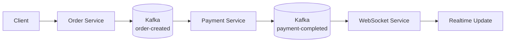
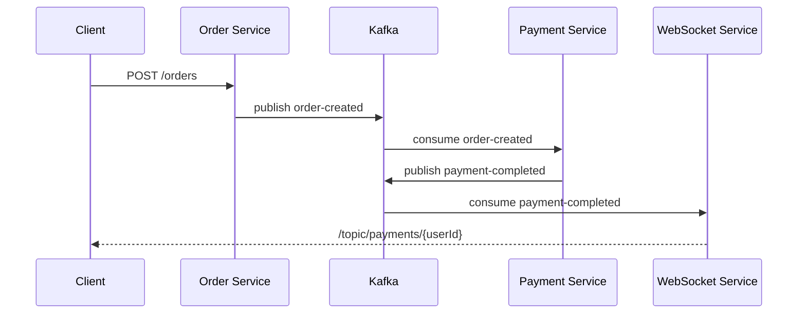

# event-driven-msa-lab

Kafka, Kubernetes, Redis, WebSocket 기반 이벤트 드리븐 아키텍처를 **단계적으로 직접 구축해보는 실습형 모노레포**입니다.

이 프로젝트의 목적은 단순 CRUD 가 아니라, 작은 범위 안에서 아래 흐름을 실제로 만들어보는 것입니다.

- 서비스 간 직접 호출 없이 이벤트로 연결하기
- 비동기 흐름을 코드 구조로 분리하기
- 결제 완료 상태를 실시간으로 전달하기
- 이후 Outbox, Retry, Idempotency, Redis 같은 실무 패턴을 자연스럽게 확장하기

## 현재 상태

현재 브랜치는 **Phase 2 기준의 기본 이벤트 흐름 코드**를 포함합니다.

- `order-service`: 주문 생성 API와 `order-created` 발행
- `payment-service`: `order-created` 소비 후 `payment-completed` 발행
- `websocket-service`: `payment-completed` 소비 후 WebSocket 브로드캐스트
- `event-contracts`: 서비스 간 공유 이벤트 계약
- Embedded Kafka 기반 테스트로 각 슬라이스 검증

아직 구현하지 않은 범위는 의도적으로 남겨두었습니다.

- DB 영속화
- Outbox Pattern
- Retry / DLQ 전략
- Idempotency
- Redis 기반 replay 방지 및 캐시
- 애플리케이션의 k3s 실제 배포 매니페스트

## 아키텍처 개요



## 이벤트 시퀀스



## 모듈 구조

```text
event-driven-msa-lab
├── event-contracts
├── infra
│   ├── k3s
│   └── kafka
├── order-service
├── payment-service
├── scripts
│   └── dev
└── websocket-service
```

### `event-contracts`

서비스 간에 공유하는 이벤트 계약 모듈입니다.

- `DomainEvent`
- `OrderCreatedEvent`
- `PaymentCompletedEvent`

이 모듈은 **비즈니스 로직 없이 계약만 유지**하는 것이 원칙입니다.

### `order-service`

주문 생성 HTTP 진입점입니다.

- `POST /orders`
- 주문 ID 생성
- `order-created` 이벤트 발행

### `payment-service`

주문 생성 이벤트를 소비해서 결제 완료 이벤트로 변환하는 서비스입니다.

- `@KafkaListener` 로 `order-created` 소비
- mock 결제 처리
- `payment-completed` 발행

### `websocket-service`

결제 완료 이벤트를 실시간 채널로 릴레이하는 서비스입니다.

- `@KafkaListener` 로 `payment-completed` 소비
- STOMP/WebSocket endpoint `/ws`
- 사용자별로 보이도록 분리된 destination `/topic/payments/{userId}` 로 브로드캐스트

> 주의: 현재 Phase 2 구현은 **인증/인가가 없는 데모용 WebSocket 채널**입니다. 즉, destination 경로는 사용자별로 나뉘어 보이지만 보안적으로 격리된 채널은 아닙니다.

## 기술 스택

- Java 17
- Spring Boot 3.4.x
- Spring Kafka
- Spring WebSocket (STOMP)
- Gradle multi-module build
- JUnit 5
- Embedded Kafka Test

## 로컬 애플리케이션 실행

저장소 루트에서 실행합니다.

```bash
./gradlew test
./gradlew :order-service:bootRun
./gradlew :payment-service:bootRun
./gradlew :websocket-service:bootRun
```

> 참고: 현재 애플리케이션은 Kafka 브로커 주소를 `KAFKA_BOOTSTRAP_SERVERS` 환경 변수로 받을 수 있습니다. 지정하지 않으면 기본값은 `localhost:9092` 입니다.

## 로컬 k3s + Kafka 운영 자산

이 저장소는 **k3s 클러스터가 이미 준비된 상태**를 전제로 Kafka 운영 스크립트를 제공합니다.

왜 이렇게 했는가?

- k3s 설치 자체는 OS/개발 환경 의존성이 큽니다.
- 반면 Kafka 배포 자산은 저장소 안에서 버전 관리하는 편이 재현성이 좋습니다.

### 포함된 파일

- `infra/k3s/README.md`
- `infra/kafka/values-dev.yaml`
- `scripts/dev/up.sh`
- `scripts/dev/down.sh`
- `scripts/dev/status.sh`
- `scripts/dev/topic.sh`
- `Makefile`

### 사용 흐름

```bash
make dev-up
make dev-status
make dev-topic-create-order
make dev-topic-create-payment
make dev-topic-list
```

### 현재 인프라 범위

- single-node k3s 가 준비되어 있다고 가정
- Helm 으로 Bitnami Kafka chart 설치
- KRaft 모드와 단일 replica 기준의 개발용 설정
- 기본 접근 방식은 **클러스터 내부 통신 기준**

즉, 지금 단계는 **클러스터 안에 Kafka 를 일관되게 올리는 것**까지가 목표입니다. 호스트에서 띄운 Spring Boot 프로세스가 k3s 내부 Kafka 에 직접 붙는 external listener 전략은 아직 포함하지 않았습니다.

따라서 현재 로컬 실행 경로는 두 가지로 나뉩니다.

1. 애플리케이션 기능 검증: `./gradlew test`, `bootRun`, Embedded Kafka 기반 검증
2. 클러스터 인프라 검증: `make dev-up`, `make dev-status` 로 k3s 내부 Kafka 배포 자산 확인

## 테스트 전략

현재 브랜치에서는 기능별로 다음 검증을 수행합니다.

- `event-contracts`: 계약 생성 및 JSON 직렬화 테스트
- `order-service`: HTTP 호출 후 `order-created` 발행 검증
- `payment-service`: `order-created` 소비 후 `payment-completed` 발행 검증
- `websocket-service`: `payment-completed` 소비 후 STOMP destination 브로드캐스트 검증

실행 명령:

```bash
./gradlew test
```

## 단계별 로드맵

### Phase 1

- 멀티모듈 구조 만들기
- 서비스 부트스트랩 정리
- 이벤트 계약 분리

### Phase 2

- 주문 → 결제 → WebSocket 이벤트 흐름 연결
- Kafka producer / consumer 추가
- 테스트 가능한 최소 수직 슬라이스 완성

### Phase 3

- 영속화 추가
- Outbox Pattern 도입
- Retry / DLQ 전략 추가
- Idempotency 추가

### Phase 4

- Redis 연동
- 애플리케이션의 k3s 배포 자산 정리
- 관측성/운영 보조 스크립트 확장

## 설계 원칙

1. **공유 계약은 작게 유지한다.**
2. **서비스 경계는 코드로 분리한다.**
3. **기능은 작은 수직 슬라이스로 추가한다.**
4. **인프라는 저장소 안에서 재현 가능해야 한다.**
5. **지금 단계에서 Phase 3 복잡도를 미리 당겨오지 않는다.**

## 이 저장소를 보는 사람에게

이 프로젝트는 “모든 것을 한 번에 구현한 완성형 샘플”이 아니라, **이벤트 드리븐 시스템을 실무 감각으로 단계별 확장해가는 학습용 프레임**입니다.

그래서 일부 미구현 영역은 의도적입니다. 지금 브랜치의 핵심 가치는 다음 두 가지입니다.

1. 모듈 경계가 명확한 출발점
2. Order → Payment → WebSocket 으로 이어지는 최소 이벤트 흐름
