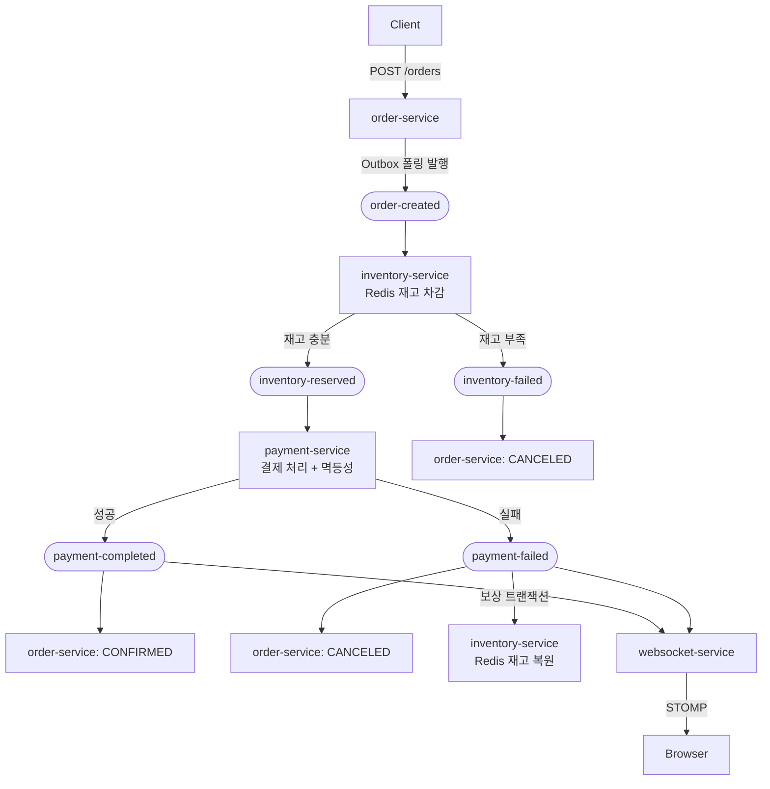
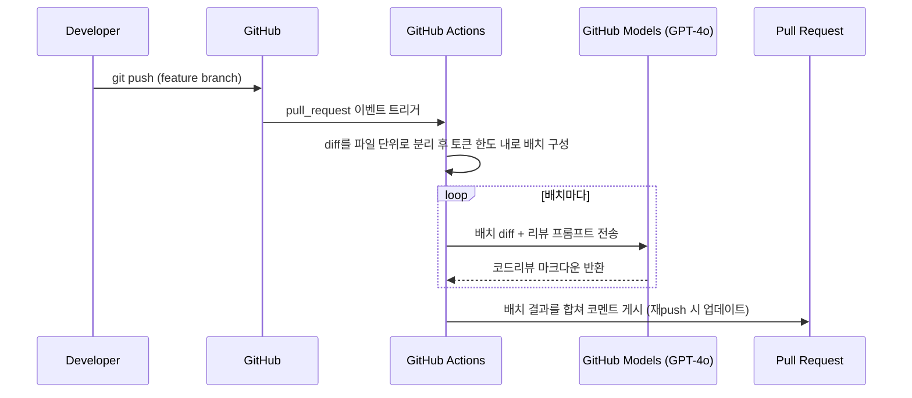

# event-driven-msa-lab

Kafka 기반 이벤트 드리븐 MSA에서 실제로 마주치는 분산 시스템 문제들 — **데이터 정합성, 중복 처리, 분산 트랜잭션** — 을 단계별로 직접 구현하며 해결한 실습형 프로젝트입니다.

단순 CRUD가 아니라, "서비스가 여러 개로 쪼개지면 생기는 진짜 문제"를 의도적으로 만들고 패턴으로 해결하는 것이 목표입니다.

- DB 저장과 메시지 발행을 어떻게 원자적으로 묶을 것인가 → **Outbox 패턴**
- 메시지가 중복으로 와도 비즈니스 로직이 한 번만 실행되게 하려면 → **멱등성(Idempotency)**
- 처리할 수 없는 메시지를 무한 재시도하지 않으려면 → **DLQ (Dead Letter Queue)**
- 여러 인스턴스가 동시에 폴링해도 중복 발행이 안 되려면 → **분산 락 (ShedLock)**
- RDB(주문/결제)와 NoSQL(Redis 재고)에 걸친 트랜잭션을 2PC 없이 처리하려면 → **Choreography Saga + 보상 트랜잭션**

## 한눈에 보는 이벤트 흐름


```mermaid
flowchart TB
    Client[Client] -->|POST /orders| Order[order-service]
    Order -->|Outbox 폴링 발행| OC([order-created])
    OC --> Inventory[inventory-service<br/>Redis 재고 차감]

    Inventory -->|재고 충분| IR([inventory-reserved])
    Inventory -->|재고 부족| IF([inventory-failed])

    IR --> Payment[payment-service<br/>결제 처리 + 멱등성]
    Payment -->|성공| PC([payment-completed])
    Payment -->|실패| PF([payment-failed])

    IF --> Order2[order-service: CANCELED]
    PC --> Order3[order-service: CONFIRMED]
    PF --> Order4[order-service: CANCELED]
    PF -->|보상 트랜잭션| Inventory2[inventory-service<br/>Redis 재고 복원]

    PC --> WS[websocket-service]
    PF --> WS
    WS -->|STOMP| Browser[Browser]
```

**Choreography Saga**: 중앙 오케스트레이터 없이, 각 서비스가 이벤트를 듣고 자기 일을 한 뒤 다음 이벤트를 발행합니다. 결제가 실패하면 `payment-failed` 이벤트를 inventory-service가 받아서 **이미 차감한 재고를 다시 복원**하는 보상 트랜잭션을 수행합니다.

## 구현된 패턴과 위치

| 패턴 | 문제 | 구현 위치 |
|---|---|---|
| **Outbox** | RDB 저장과 Kafka 발행의 원자성 | [`OutboxEvent`](order-service/src/main/java/com/example/kafkatoy/order/OutboxEvent.java), [`OutboxPublisher`](order-service/src/main/java/com/example/kafkatoy/order/OutboxPublisher.java) |
| **멱등성** | Kafka at-least-once로 인한 중복 처리 | [`PaymentService.process()`](payment-service/src/main/java/com/example/kafkatoy/payment/PaymentService.java) — `existsById` 체크 |
| **DLQ** | 처리 불가 메시지의 무한 재시도 방지 | [`KafkaConsumerConfig`](payment-service/src/main/java/com/example/kafkatoy/payment/KafkaConsumerConfig.java) — `DefaultErrorHandler` + `DeadLetterPublishingRecoverer` |
| **분산 락 (ShedLock)** | 여러 인스턴스의 Outbox 폴링 중복 실행 | [`ShedLockConfig`](order-service/src/main/java/com/example/kafkatoy/order/ShedLockConfig.java) |
| **Saga + 보상 트랜잭션** | RDB/Redis에 걸친 분산 트랜잭션 | [`InventoryService.reserve()/compensate()`](inventory-service/src/main/java/com/example/kafkatoy/inventory/InventoryService.java) — Lua 스크립트로 원자적 재고 차감/복원 |
| **실시간 알림** | 비동기 처리 결과를 클라이언트에 전달 | [`websocket-service`](websocket-service) — Spring WebSocket + STOMP |
| **Actuator Probe** | k8s readiness/liveness로 안전한 롤링 배포 | 각 서비스 `application.yml` + `infra/k3s/apps/*.yaml` |

> 보상 트랜잭션의 원자성 버그(재고 복원과 예약 삭제가 부분 실패할 수 있던 문제)를 코드리뷰로 발견하고 Lua 스크립트로 고친 과정은 [`docs/blog-idempotency-and-outbox.md`](docs/blog-idempotency-and-outbox.md)에 정리했습니다.

## 모듈 구조

```text
event-driven-msa-lab
├── event-contracts      # 서비스 간 공유 이벤트 계약 (비즈니스 로직 없음)
├── order-service         # 주문 생성, 상태 관리, Outbox 발행
├── inventory-service     # Redis 기반 재고 관리, 보상 트랜잭션
├── payment-service       # 결제 처리, DB 기반 멱등성
├── websocket-service     # 결제 결과 실시간 브로드캐스트 (STOMP)
├── infra
│   ├── k3s/apps          # kustomize 기반 k8s 매니페스트
│   └── kafka             # Kafka Helm values
└── scripts/ai-review     # PR 자동 코드리뷰 (GitHub Actions + GitHub Models)
```

| 모듈 | 포트 | 역할 |
|---|---|---|
| `event-contracts` | — | `OrderCreatedEvent`, `InventoryReservedEvent`, `InventoryFailedEvent`, `PaymentCompletedEvent`, `PaymentFailedEvent` |
| `order-service` | 8081 | 주문 생성 API, Outbox 패턴, ShedLock |
| `inventory-service` | 8084 | Redis 재고 차감/복원 (Lua 스크립트 원자성 보장) |
| `payment-service` | 8082 | 결제 처리, 멱등성, DLQ |
| `websocket-service` | 8083 | STOMP 기반 실시간 알림 |

## 기술 스택

- Java 21 + Spring Boot 3 (Spring Web, Spring Data JPA, Spring Data Redis, Spring Kafka)
- H2 (order/payment-service 각각 독립 DB) + Redis (inventory-service)
- Kafka (KRaft 모드) — 로컬 검증은 `docker-compose`, 통합 테스트는 `EmbeddedKafka`
- Kubernetes (k3s 호환 클러스터 — OrbStack/k3d 등) + kustomize
- ShedLock (DB 기반 분산 락)
- Gradle 멀티모듈

## 로컬 실행

```bash
./gradlew test                          # 전체 유닛/통합 테스트
./gradlew :order-service:bootRun
./gradlew :payment-service:bootRun
./gradlew :inventory-service:bootRun
./gradlew :websocket-service:bootRun
```

Kafka 브로커 주소는 `KAFKA_BOOTSTRAP_SERVERS` 환경변수로 주입합니다 (기본값 `localhost:9092`). Redis는 `REDIS_HOST` / `REDIS_PORT` (기본값 `localhost:6379`).

## k8s 배포

k3s 호환 클러스터(OrbStack, k3d 등)가 준비된 상태에서:

```bash
make app-build      # 3개 서비스 Docker 이미지 빌드
make app-deploy      # kustomize 매니페스트 적용 (Redis, Kafka, order/payment/inventory/websocket-service)
make app-status      # 파드 상태 확인
```

매니페스트는 `infra/k3s/apps/kustomization.yaml`로 관리되며, Actuator 기반 readiness/liveness probe로 안전한 롤링 배포를 지원합니다.

## 테스트 전략

- `event-contracts`: 이벤트 레코드 생성/직렬화 테스트
- `order-service`: `EmbeddedKafka` 기반 — HTTP 요청 → Outbox 발행 → 토픽 발행 검증
- `payment-service`: `inventory-reserved` 소비 → `payment-completed` 발행 + 멱등성 검증
- `inventory-service`: Redis 기반 재고 차감/복원의 원자성 검증

```bash
./gradlew test
```

## AI 코드리뷰 자동화

PR이 열리거나 push되면 GitHub Actions가 diff를 파일 단위로 분석해 GitHub Models(GPT-4o)로 한국어 코드리뷰를 자동 게시합니다.


```mermaid
sequenceDiagram
    participant Dev as Developer
    participant GH as GitHub
    participant Actions as GitHub Actions
    participant Models as GitHub Models (GPT-4o)
    participant PR as Pull Request

    Dev->>GH: git push (feature branch)
    GH->>Actions: pull_request 이벤트 트리거
    Actions->>Actions: diff를 파일 단위로 분리 후 토큰 한도 내로 배치 구성
    loop 배치마다
        Actions->>Models: 배치 diff + 리뷰 프롬프트 전송
        Models-->>Actions: 코드리뷰 마크다운 반환
    end
    Actions->>PR: 배치 결과를 합쳐 코멘트 게시 (재push 시 업데이트)
```

큰 PR(예: 새 모듈 추가)에서 diff가 모델의 토큰 한도(8000 tokens)를 초과해 리뷰가 통째로 실패하는 문제를, **파일 단위로 diff를 쪼개 배치 호출**하는 방식으로 해결했습니다 — [`scripts/ai-review/review.py`](scripts/ai-review/review.py).

| 레벨 | 기준 |
|---|---|
| P1 Blocker | 머지 전 반드시 수정 — 보안 취약점, 데이터 손실 위험 |
| P2 Critical | 머지 전 강하게 권장 — 테스트 미커버, 회귀 위험 |
| P3 Major | 후속 PR 수정 — 성능·가독성 |
| P4 Minor | 선택 사항 |
| P5 Nit | 단순 의견 |

## 진행 단계

| 단계 | 내용 | 상태 |
|---|---|---|
| 1 | 멀티모듈 구조 + 주문/결제/WebSocket 최소 이벤트 흐름 | ✅ |
| 2 | DB 영속화 + 전체 상태 전이 (PENDING/CONFIRMED/CANCELED) | ✅ |
| 3 | Outbox 패턴 | ✅ |
| 4 | DLQ + k3s 운영 설정 | ✅ |
| 5 | WebSocket 실시간 알림 | ✅ |
| 6 | Spring Actuator + HTTP Probe + Ingress | ✅ |
| 7 | ShedLock 분산 락 + 스케일아웃 | ✅ |
| 8 | **Choreography Saga + inventory-service(Redis) + 보상 트랜잭션** | ✅ |

각 단계는 feature 브랜치 → PR(자동 코드리뷰) → main 머지 순서로 진행했습니다.

## 설계 원칙

1. **공유 계약(event-contracts)은 비즈니스 로직 없이 작게 유지한다.**
2. **서비스 경계는 저장소(DB)로도 분리한다** — order/payment는 각자 H2, inventory는 Redis.
3. **강한 일관성보다 결과적 일관성을 택한다** — 2PC 대신 Outbox + 멱등성 + Saga 조합.
4. **원자성이 필요한 다단계 작업은 단일 명령으로 묶는다** — Redis Lua 스크립트, 같은 DB 트랜잭션.
5. **인프라는 저장소 안에서 재현 가능해야 한다** — kustomize 매니페스트, Helm values 모두 버전 관리.
